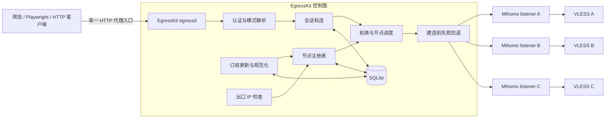

# EgressKit 产品规格

> 状态：已确认的产品与技术基线，尚未实现  
> 产品形态：开源、自托管  
> 核心定位：一个代理入口，动态管理多个出口  
> 英文定位：One proxy endpoint, many managed exits.

## Problem Statement

使用 Clash/Mihomo VLESS 订阅的开发者，通常能获得一组可用代理节点，但缺少一个适合程序化调用的稳定代理入口。调用方如果直接管理节点，需要自行处理订阅更新、配置格式差异、节点健康、端口分配、并发调度、会话粘连、失败回退、运行时重载和状态持久化。这些能力会在爬虫和 Playwright 浏览器自动化中被反复实现，而且很容易出现并发竞态、出口漂移、错误重试和秘密泄漏。

用户需要把多个 VLESS 节点聚合成一个标准 HTTP 代理服务。调用方只连接一个地址，通过代理用户名选择 `rotate`、`sticky`、`strict` 或指定节点模式；EgressKit 在后台维护订阅和节点池，并将每个新连接路由到正确的 Mihomo 出口。

现有 Mihomo 代理组能够做全局选择或内部负载均衡，但不能直接表达调用方的业务会话语义。请求前切换共享 `select` 组还会产生并发竞态。EgressKit 要解决的不是 VLESS 协议实现，而是 VLESS 节点之上的控制面、会话语义和单一代理入口。

## Solution

EgressKit 将作为一个 Node.js 22+、TypeScript 编写的自托管代理网关运行。它对外提供一个完整 HTTP 代理入口，支持普通 HTTP 代理请求和 HTTPS `CONNECT`；对内启动并管理官方 Mihomo 稳定版独立进程。每个活跃 VLESS 节点对应一个仅在本机监听的 Mihomo HTTP listener，listener 固定绑定到一个出站节点。EgressKit 通过选择内部 listener 精确控制每个新代理请求或 CONNECT 隧道的出口。

产品的首要使用场景是网页抓取和 Playwright 浏览器自动化。EgressKit 不解密 HTTPS，不查看业务内容，也不在隧道建立后尝试无缝切换出口。透明失败回退仅发生在向客户端确认隧道建立之前；隧道建立后的失败由客户端重新连接，下一条连接再按会话策略选路。

EgressKit 默认使用 SQLite 保存控制面状态，包括原始订阅 URL、规范化 VLESS 节点、节点 generation、稳定端口、会话绑定、运行时 revision 和异步 operation。数据明文保存，不使用 SQLCipher，不做字段加密，也不主动收紧 SQLite 文件权限；部署者负责状态目录的本机访问和备份安全。

EgressKit 提供 CLI、守护进程、HTTP 管理 API、本机 Unix socket 管理 API、结构化日志和 Prometheus 指标。CLI 只调用管理 API，不直接访问 SQLite；`egressd` 是数据库的唯一写入者。

## User Stories

1. 作为爬虫开发者，我希望只配置一个 HTTP 代理地址，从而不必在业务代码里管理一组 VLESS 节点。
2. 作为 Playwright 使用者，我希望浏览器的多个连接能够通过同一个 EgressKit 入口，从而复用标准浏览器代理配置。
3. 作为自托管用户，我希望从远程 Clash/Mihomo YAML 订阅导入节点，从而复用现有代理供应来源。
4. 作为自托管用户，我希望从本地 Clash/Mihomo YAML 文件导入节点，从而可以在不依赖远程订阅的环境中运行。
5. 作为运维者，我希望 EgressKit 定时刷新远程订阅，从而自动获得供应方的节点更新。
6. 作为运维者，我希望原始订阅 URL 保存在 SQLite 中，从而让守护进程在重启后继续定时更新。
7. 作为运维者，我希望首次订阅拉取失败时仍然保存 URL，从而不必在临时网络故障后重新录入。
8. 作为运维者，我希望订阅更新区分已保存、已下载、已解析、已验证、已应用和已健康，从而不会把部分成功误认为完整成功。
9. 作为运维者，我希望异常缩减的订阅不会自动清空当前节点池，从而抵御供应方错误页、空响应和截断内容。
10. 作为运维者，我希望能够显式强制应用可疑订阅 revision，从而在确认供应方确实大幅删减节点时继续更新。
11. 作为运维者，我希望临时订阅错误自动重试，从而无需人工处理短时 DNS、超时、限流或上游 5xx。
12. 作为运维者，我希望永久订阅错误停止循环重试，从而避免持续请求错误 URL 或无效凭据。
13. 作为用户，我希望订阅中只有经过严格校验的 VLESS 节点进入运行时，从而避免未知配置直接控制 Mihomo。
14. 作为用户，我希望 EgressKit 从订阅生成自己的专用 Mihomo 配置，从而不修改我的日常 Clash/Mihomo 配置。
15. 作为用户，我希望每个活跃 VLESS 节点具有独立的内部 listener，从而让 EgressKit 能确定性选择出口。
16. 作为调用方，我希望使用 `rotate` 模式，从而让每个新的 CONNECT 隧道或普通 HTTP 代理请求选择最长未使用的已验证出口 IP。
17. 作为调用方，我希望 `rotate` 的语义明确限定在新连接或新代理请求，从而不会错误期待浏览器内每个 HTTPS 请求都更换 IP。
18. 作为调用方，我希望使用 `sticky` 模式，从而让相同 session key 的新连接尽量使用同一出口 IP。
19. 作为调用方，我希望 soft sticky 节点失败时自动重绑定，从而让后续连接继续工作。
20. 作为调用方，我希望了解 soft sticky 故障迁移可能短暂存在双出口，从而不会把它误认为存量连接的原子切换。
21. 作为调用方，我希望使用 `strict` 模式，从而在出口不可变比可用性更重要时禁止自动更换出口 IP。
22. 作为 strict session 使用者，我希望原节点恢复后继续沿用原绑定，从而保持预期的节点身份。
23. 作为 strict session 使用者，我希望可以使用新 session key 主动建立新会话，从而在原出口故障时自行决定是否换出口。
24. 作为调试者，我希望显式指定稳定 node ID 或 alias，从而复现该节点代表的出口 IP，并允许同 IP 节点承接建连。
25. 作为调试者，我希望指定节点不可用时请求直接失败，从而不会被无提示地路由到其他出口。
26. 作为 sticky 使用者，我希望一次显式指定节点的调试请求不改变原 session binding，从而不会污染后续正式流量。
27. 作为并发客户端，我希望同一 session 的首次并发连接得到同一个绑定，从而避免初始化竞态导致多个出口。
28. 作为代理客户端，我希望使用标准 `Proxy-Authorization` 传递模式、session key 和访问 token，从而兼容 curl、Undici、Axios 和 Playwright。
29. 作为安全管理员，我希望代理入口默认需要认证，从而避免意外形成开放代理。
30. 作为本机开发者，我希望可以显式关闭代理认证，从而简化完全受控的本地实验。
31. 作为安全管理员，我希望非 loopback 监听在无认证时默认拒绝启动，从而减少误配置暴露。
32. 作为管理员，我希望代理访问 token 与管理 token 分离，从而隔离数据面和控制面权限。
33. 作为调用方，我希望多个代理 token 可以平滑轮换，从而避免更换凭据时同时中断所有客户端。
34. 作为调用方，我希望 EgressKit 在 VLESS 建连失败时尝试其他可用节点，从而提高建立隧道的成功率。
35. 作为调用方，我希望失败回退次数有明确上限，从而避免请求无限挂起。
36. 作为调用方，我希望 EgressKit 不自动重放已发送的业务请求，从而避免重复提交非幂等操作。
37. 作为调用方，我希望隧道建立后的故障直接关闭连接，从而让客户端在明确失败后决定如何重试。
38. 作为运维者，我希望节点的连接失败、DNS 失败、TLS/Reality 握手失败和超时累计到阈值后撤销出口 IP，从而及时避开不可用出口。
39. 作为运维者，我希望普通业务状态码不会默认全局封禁节点，从而不把目标站问题误判成代理故障。
40. 作为目标站集成方，我希望可选地反馈 `403`、`429` 或风控结果，从而建立“节点与目标范围”的临时信誉。
41. 作为隐私敏感用户，我希望目标级信誉默认关闭且不持久化完整访问域名，从而减少浏览历史留存。
42. 作为运维者，我希望节点对外只显示 available 和 unavailable，并只由是否持有已验证出口 IP 决定，从而避免状态含义混乱。
43. 作为运维者，我希望手动 enabled/disabled 与出口可用状态独立，从而保留人工调度控制权。
44. 作为运维者，我希望 unavailable 节点只能通过定时检查或手动出口检查恢复，从而让状态迁移路径明确。
45. 作为运维者，我希望出口检查真正经过对应的 Mihomo listener，从而同时验证 VLESS、TLS、Reality 和目标访问能力。
46. 作为运维者，我希望连续 10 次检查或建连失败后才撤销出口 IP，从而避免短暂网络抖动误判节点。
47. 作为运维者，我希望定时检查按顺序每轮处理可配置的 M 个节点（默认 10），并将单次并发限制为 5，从而平稳覆盖整个节点池。
48. 作为运维者，我希望调度综合延迟、成功率、连续失败、活动连接和权重，从而在可用性与负载分散之间取得平衡。
49. 作为运维者，我希望订阅节点获得稳定逻辑 ID，从而不因数组顺序变化破坏 session 和 alias。
50. 作为运维者，我希望连接参数变化产生新的节点 generation，从而允许新旧配置安全交接。
51. 作为正在使用旧 generation 的客户端，我希望旧节点进入 draining 而非立即删除，从而让现有连接自然完成。
52. 作为运维者，我希望节点彻底排空后才回收内部端口，从而避免旧连接误连到新节点。
53. 作为运维者，我希望同一订阅内出现重名节点时更新失败，从而避免静默重命名造成路由身份漂移。
54. 作为运维者，我希望为节点设置全局唯一 alias，从而使用稳定、可读的名称指定出口。
55. 作为运维者，我希望 EgressKit 在远程订阅不可用时从 SQLite恢复最后一份规范化节点配置，从而在重启后继续提供代理服务。
56. 作为运维者，我希望 SQLite只记录控制面状态而非每个请求和数据包，从而避免数据库成为流量瓶颈或浏览历史库。
57. 作为运维者，我希望高频连接状态保存在内存并聚合写入，从而减少 SQLite 单写者压力。
58. 作为运维者，我希望 `egressd` 成为 SQLite 唯一写入者，从而维护事务和状态机的一致性。
59. 作为 CLI 用户，我希望所有修改通过管理 API执行，从而获得与 daemon 相同的校验和完整应用结果。
60. 作为 CLI 用户，我希望 daemon 未运行时修改命令明确失败，从而不会产生尚未被运行时发现的离线数据库改动。
61. 作为 CLI 用户，我希望默认查看完整订阅 URL，从而方便复制、核对和迁移订阅。
62. 作为 CLI 用户，我希望可以使用 `--redact` 隐藏订阅 URL，从而安全地将输出放入 CI 日志或工单。
63. 作为 CLI 用户，我希望可以从标准输入添加订阅 URL，从而避免 URL进入 shell history。
64. 作为远程管理 API调用方，我希望订阅 URL始终脱敏，从而不能通过 HTTP 管理面读出完整凭据。
65. 作为本机 CLI 用户，我希望通过 Unix socket 管理 API读取完整 URL，从而同时满足本机可见与远程脱敏。
66. 作为管理员，我希望管理 API和本机 socket 都要求 admin token，从而不只依赖 transport 位置进行授权。
67. 作为管理员，我希望添加或更新订阅返回 operation ID，从而跟踪耗时的下载、应用和健康检查过程。
68. 作为管理员，我希望 daemon 重启后把遗留的运行中 operation 标记为 interrupted，从而避免任务永久停留在运行状态。
69. 作为监控系统，我希望访问 `/live` 判断 Node 进程是否存活，从而进行基础存活探测。
70. 作为监控系统，我希望访问 `/ready` 判断 Mihomo 与节点池是否能够接流量，从而进行就绪探测。
71. 作为监控系统，我希望获取 Prometheus 指标，从而观察连接、回退、节点、订阅和延迟。
72. 作为隐私敏感用户，我希望指标不以 session、完整域名或订阅 URL作为 label，从而避免高基数和秘密泄漏。
73. 作为运维者，我希望日志最多记录订阅 URL的 scheme、host 和 port，从而保留基本诊断能力而不记录 path、userinfo 或 query。
74. 作为运维者，我希望 SQLite 明文保存并沿用系统默认权限，从而避免额外密钥管理和权限修改逻辑。
75. 作为运维者，我希望文档明确数据库和备份可能包含订阅及节点凭据，从而由部署者自行承担状态目录保护责任。
76. 作为运维者，我希望候选 Mihomo 配置先通过官方内核检查，从而在应用前发现语法和静态配置错误。
77. 作为运维者，我希望配置更新失败时恢复上一份运行配置，从而减少订阅错误对现有流量的影响。
78. 作为运维者，我希望 Mihomo 异常退出时进行有界退避重启，从而兼顾自动恢复与避免 crash loop。
79. 作为运维者，我希望 Mihomo 持续启动失败时 EgressKit 进入明确 failed/not-ready 状态，从而不会假装服务正常。
80. 作为运维者，我希望显式安装官方 Mihomo 稳定版并校验 SHA-256，从而减少第三方二进制和供应链风险。
81. 作为 npm 用户，我希望安装依赖时不会通过 `postinstall` 隐式下载内核，从而让安装行为可审计。
82. 作为 Docker 用户，我希望镜像内置一个固定 Mihomo 版本，从而获得可复现部署。
83. 作为开源贡献者，我希望 Mihomo 被封装在 runtime 接口后，从而未来可以增加其他 runtime 而不改调度层。
84. 作为开源贡献者，我希望正式支持范围限定为 Linux、macOS 和 Linux Docker，从而保持可验证的跨平台矩阵。
85. 作为开源采用者，我希望 EgressKit 与独立 Mihomo 的许可证和归属说明清晰，从而理解再分发义务。

## Implementation Decisions

### 产品和运行时

- 项目正式命名为 EgressKit；CLI 名称为 `egresskit`，守护进程名称为 `egressd`，环境变量统一使用 `EGRESSKIT_` 前缀。
- EgressKit 使用 Node.js 22 LTS 或更高版本和 TypeScript strict mode 实现。
- Mihomo 作为独立 GPL-3.0 进程运行，不作为 Go library 链接，不使用 FFI，不 fork，不修改内核源码。
- v1 只正式支持官方 Mihomo 稳定版。用户可以提供二进制路径，也可以显式执行 runtime 安装命令；npm 安装不得隐式下载二进制。
- Docker 镜像锁定明确 Mihomo 版本与校验值，不依赖浮动的 latest 或 Alpha。
- EgressKit 通过 Mihomo CLI、专用配置文件、Controller API 和本机 HTTP listeners 四个边界集成内核。
- EgressKit 拥有并生成完整的专用 Mihomo 运行配置，不修改或合并用户自己的日常 Clash 配置。

### 代理入口和选路

- 对外提供一个完整 HTTP 代理入口，支持普通 HTTP absolute-form 和 HTTPS CONNECT。
- 每个活跃 VLESS 节点对应一个独立的本机 Mihomo HTTP listener；listener 的固定 proxy 指向对应出站节点。
- 内部 listeners 只绑定 loopback，不作为公开接口。
- 代理用户名协议表达调度模式和 session key；代理密码承载访问 token。
- 用户名模式包括 rotate、soft sticky、strict sticky 和指定 node ID/alias。
- rotate 按新 CONNECT 隧道或普通 HTTP 代理请求轮换出口 IP，不承诺按 HTTPS 隧道内部的每个业务请求轮换。
- soft sticky 对新连接维持出口 IP 绑定；同 IP 传输节点切换不构成出口迁移。
- strict sticky 在同 IP 节点全部不可用时失败，不自动更换出口 IP。绑定 TTL 到期或调用方更换 session key 后才能改变行为。
- 显式指定节点先解析其出口 IP，可在同 IP 节点间建连前回退，但不回退到其他 IP；显式指定不修改已有 sticky binding。
- 同一 session 的首次绑定使用 session 级互斥，锁只覆盖读取、选择和写入，不覆盖连接生命周期。
- 默认 absolute TTL 为 30 分钟、最大空闲时间为 5 分钟、单 session 最大并发连接为 50、最大活跃 session 为 10,000。

### 失败回退和重试

- 透明回退只发生在向客户端确认代理连接或 CONNECT 隧道建立之前。
- 默认最多尝试三个不同候选节点，实际次数可配置但必须有硬上限。
- 一旦 CONNECT 200 已返回或业务请求已发送，不自动切换隧道或重放请求。
- 普通 HTTP 的 GET/HEAD 在 v1 也不由网关自动跨节点重放；请求级重试由调用方负责。
- 连接、DNS、TLS/Reality 握手、超时和明确代理错误进入节点健康统计。
- HTTP 业务状态码默认不影响全局节点健康。
- 目标级 `403`、`429` 和风控信誉是可选能力，默认关闭；HTTPS 结果由调用方通过反馈 API提供。
- 调用方取消和主动断开不计为节点失败。

### 节点模型和生命周期

- 节点身份由稳定 logical node ID、配置 generation、可选 alias 和 display name 组成。
- 同一订阅与规范化节点名决定逻辑身份；连接参数变化产生新 generation。
- 同一订阅内重名节点使 revision 校验失败，不静默重命名。
- 不同订阅的同名节点是不同逻辑节点。
- alias 全局唯一，冲突时拒绝保存或应用。
- 对外节点状态只有 available 和 unavailable；有已验证出口 IP 才是 available。
- 手动 enabled/disabled 与运行健康状态独立；手动禁用不会被自动探活覆盖。
- 订阅移除节点时先进入 draining，停止接收新分配；活动连接归零后才删除 listener、关闭内部连接资源并隔离端口。
- 内部端口分配持久化且稳定，不由订阅数组下标决定。
- 连续 10 次出口检查或代理建连失败时撤销出口 IP，节点转为 unavailable。
- 默认从高分候选中进行加权选择，避免所有流量长期集中在单一最低延迟节点。

### 健康检查

- 出口检查必须通过节点对应的内部 Mihomo listener 发出，不能只测试远端 TCP 端口。
- 定时检查按节点顺序分批执行，默认每轮 10 个，单次最多并发 5 个。
- 每次成功检查都更新并持久化出口 IP；失败累计到 10 次才撤销现有出口身份。
- unavailable 只能通过定时检查或用户手动单个、全量检查恢复。

### 订阅更新

- v1 支持远程 HTTPS Clash/Mihomo YAML 和本地 YAML 文件。
- v1 只导入 type 为 VLESS 的节点，并通过运行时 Schema 规范化允许字段。
- 原始订阅配置不是 Mihomo 最终配置，未知字段不能无条件透传。
- 原始订阅 URL无论首次拉取成功与否都先保存；首次处理通过异步 operation 执行。
- operation 状态包括 queued、fetching、parsing、validating、applying、checking、succeeded、failed 和 interrupted。
- 临时网络、408、429 和常见上游 5xx 自动退避重试；URL、认证、格式和节点 Schema 等永久错误默认等待人工修正或重试。
- 订阅解析结果为零、低于最小节点数或相对上一版减少超过默认 50% 时标记 suspicious，不自动替换当前有效 revision。
- 用户可以通过 CLI显式查看并强制应用 suspicious revision。
- 新 revision 按解析、静态验证、Mihomo 接受、listener 就绪和节点健康分层记录，任何层都不能冒充下一层已成功。
- 一个新增坏节点不会阻止同一 revision 的其他合法节点被激活；整份配置无法加载时保持上一版。

### SQLite

- SQLite 是 v1 唯一持久化后端，不支持 Redis。
- SQLite 明文保存原始订阅 URL和规范化 VLESS 节点配置，不使用 SQLCipher或字段加密。
- EgressKit 不主动改变 SQLite、WAL、SHM 和 runtime 配置的操作系统默认权限；部署者负责状态目录、备份和宿主机访问控制。
- SQLite 保存订阅、订阅 revisions、节点、node generations、alias、端口分配、session bindings、runtime revisions、operations、手动覆盖和 Schema 元数据。
- 不保存每个代理请求、数据包、请求正文、响应正文、Cookie、Proxy-Authorization 或完整浏览历史。
- 原始 session key 不持久化，session identity 使用 HMAC 后的标识。
- 实时连接数、socket 生命周期、瞬时健康状态和高频调度数据保存在内存；必要统计周期性聚合写入。
- 启用 WAL、foreign keys、busy timeout 和 normal synchronous 模式。
- `egressd` 是 SQLite 的唯一写入者；CLI不直接打开、迁移或修改数据库。
- daemon 启动时使用独占实例锁，避免两个 daemon 同时管理同一状态目录、数据库、端口和 Mihomo runtime。

### 管理 API和 CLI

- HTTP 管理 API默认绑定 loopback，并始终脱敏订阅 URL。
- 本机 CLI通过 Unix domain socket 管理 API执行读写；它不绕过 daemon 访问 SQLite。
- HTTP 管理 API和 Unix socket 都要求独立 admin token；admin token 与代理入口 token 不同。
- Docker 镜像内置同版本 Web 控制台，由 `egressd` 提供静态资源和 SPA 路由。
- Web 控制台覆盖概览、订阅管理、代理管理、活跃会话、快捷操作 Playground 和使用文档；登录凭据仅保存在浏览器会话中。
- 除 `/live` 与 `/ready` 基础设施探针外，Web 控制台发起的全部管理 API 请求都必须携带 admin token；代理数据面继续使用独立的 proxy token。
- CLI默认可以显示完整订阅 URL，并提供 `--redact`；HTTP API不提供读取完整 URL的能力。
- CLI支持从标准输入读取订阅 URL，减少 URL进入 shell history 的机会。
- 添加或更新订阅返回持久化 operation ID；CLI默认等待状态变化，也支持不等待并在之后查询。
- daemon 重启后将遗留 running operation 标记为 interrupted，不把未知结果标成成功。
- daemon 未运行时，CLI修改命令明确失败，不执行离线数据库写入。
- `/live` 表示 Node 进程存活；`/ready` 表示 Mihomo 就绪且至少有可调度节点。

### 认证、日志和可观察性

- 代理入口默认启用认证，支持多个 token 和轮换宽限期。
- 非 loopback 监听且认证关闭时默认拒绝启动；高风险覆盖必须显式配置并输出警告。
- 日志使用结构化格式，但订阅 URL最多记录 `scheme://host[:port]`，不记录 path、userinfo、query 或 fragment。
- 日志不得记录 Proxy-Authorization、Cookie、VLESS UUID、Mihomo controller secret 或完整节点配置。
- Prometheus 指标覆盖连接、建连失败、回退、节点状态、订阅 operation、活跃 session 和延迟。
- 指标 label 不使用原始 session、完整目标域名、订阅 URL或其他高基数秘密。
- 目标级信誉默认不持久化域名；启用后的反馈状态仅驻留内存。

### 运行时恢复

- 候选配置先由官方 Mihomo 执行静态检查，再请求运行时应用。
- EgressKit 保留 active、candidate 和 previous 三个运行配置状态用于回滚。
- 应用失败后显式恢复 previous；回滚仍失败时 runtime 进入 failed，不循环覆盖文件。
- Mihomo 异常退出采用有界指数退避：首次立即重启，随后按 1、2、5、10、30 秒退避；10 分钟内最多五次，稳定运行 10 分钟后重置。
- Mihomo 不可用时 Node 进程仍可 live，但 ready 失败，新代理请求返回 502，SQLite、订阅和 session 状态保留。

### 支持平台和许可证

- v1 正式支持 Linux x64/arm64、macOS x64/arm64，以及 linux/amd64 和 linux/arm64 Docker 镜像。
- Windows 不属于 v1 正式支持范围。
- EgressKit 采用 Apache-2.0；Mihomo 继续作为独立 GPL-3.0 程序，发布物保留其版权、许可证和源码获取说明。
- 正式发布前需要复核捆绑 Mihomo 二进制时的 GPL-3.0 合规要求；产品文档不能暗示 EgressKit 拥有 Mihomo。

## Testing Decisions

### 测试原则

- 测试优先验证外部可观察行为，不对内部私有方法、定时器实现或具体容器结构做脆弱断言。
- 最高级主测试 seam 是完整代理入口：测试客户端连接 EgressKit，EgressKit 选择一个模拟 Mihomo HTTP listener，最终由可观察的测试目标确认出口选择。
- 第二测试 seam 是订阅服务边界：使用受控 HTTP fixture server 返回合法 YAML、无效 YAML、HTML、空响应、截断响应、429 和 5xx。
- 第三测试 seam 是官方 Mihomo 真实进程：在受控环境中生成配置、启动内核、创建 listeners，并使用用户授权的 VLESS 节点完成端到端验证。
- SQLite通过 daemon 对外行为测试，不让 CLI测试直接修改表；数据库迁移和事务约束可以有少量专门集成测试。
- 时间相关逻辑使用可控制的时钟 seam，覆盖 TTL、空闲过期、退避、分批出口检查和 operation 中断恢复。
- 网络失败使用可控的 listener、目标服务器和连接阶段注入，不依赖不稳定的公网状态作为普通 CI测试。
- 真实 VLESS 和真实公网健康目标测试独立标记，不作为没有秘密的普通 PR CI硬依赖。

### 主代理 seam

- 验证普通 HTTP请求可以经单一入口到达指定模拟出口。
- 验证 CONNECT成功前可以从失败节点回退到可用节点。
- 验证 CONNECT 200 返回后，上游中断只关闭隧道，不在中途重放或切换。
- 验证 rotate 对每个新 CONNECT或普通 HTTP代理请求重新选择节点。
- 验证同一 soft sticky session 的并发首次连接只创建一个绑定。
- 验证 soft sticky 失败后新连接重新绑定，而已有连接不被强制迁移。
- 验证 strict sticky 节点失败时不自动换节点。
- 验证指定 node ID/alias 确定性路由，且失败时不回退。
- 验证一次指定节点请求不改变原 sticky binding。
- 验证认证失败、无认证和格式错误的代理用户名得到明确代理错误。
- 验证客户端取消不会计入节点失败。
- 验证最大回退次数和连接超时是有界的。

### 订阅 seam

- 验证有效 Clash/Mihomo YAML只导入合法 VLESS 节点。
- 验证非 VLESS 节点被忽略且不会进入生成配置。
- 验证重名、缺失必需字段和不支持的传输组合使 revision 失败。
- 验证首次拉取失败时 URL仍被保存，operation 显示准确失败阶段。
- 验证临时错误进入退避重试，永久错误等待人工操作。
- 验证 429 的 Retry-After 被遵循。
- 验证零节点、低于最小节点数和超过下降阈值的更新进入 suspicious。
- 验证强制应用必须通过明确管理操作触发。
- 验证日志中的 URL仅保留 scheme、host 和 port。
- 验证 HTTP 管理 API永远不返回完整订阅 URL，而本机 CLI控制通道可以返回。

### 节点和运行时 seam

- 验证节点数组重排不会改变 stable node ID或端口。
- 验证配置变化产生新 generation，旧 generation 进入 draining。
- 验证 draining 节点不接收新流量，活动连接归零后才移除。
- 验证端口在 listener 删除完成和隔离期结束前不会复用。
- 验证手动 disabled 不改变仅由出口 IP 决定的 available/unavailable 状态，但节点不会参与调度。
- 验证连续 10 次失败撤销出口 IP；定时或手动检查成功后恢复 available。
- 验证候选配置检查失败时 active 配置保持不变。
- 验证运行配置应用失败时执行 previous 回滚。
- 验证回滚失败时 runtime 进入 failed/not-ready。
- 验证 Mihomo crash loop 达到上限后停止自动重启。

### SQLite 和恢复 seam

- 验证 daemon 重启后可以恢复订阅、规范化节点、端口、soft sticky 和 strict sticky binding。
- 验证远程订阅不可用时仍可以从最后有效节点快照启动。
- 验证过期 session 不会在重启后恢复为有效绑定。
- 验证原始 session key 不写入 SQLite。
- 验证 SQLite包含明文订阅 URL和规范化节点配置，符合已确认的产品决策。
- 验证 EgressKit不主动改变数据库文件的默认权限。
- 验证第二个 daemon 无法同时取得同一状态目录的所有权。
- 验证遗留 running operation 在重启时转为 interrupted。
- 验证 WAL模式下管理读取和 daemon 写入能够正常并发。

### 性能和可靠性 seam

- 基准目标为最多 500 个订阅节点、100 个活跃 listener、1,000 个并发 CONNECT 和 10,000 个 session。
- 目标网关附加建连延迟 P95 小于 20ms，不包括上游代理和目标网络耗时。
- 性能数字只有在固定硬件、固定配置和可复现命令下实测后才能进入已验证能力说明。
- 长时间测试覆盖订阅更新、节点 draining、SQLite WAL、Mihomo 重启和持续 CONNECT 流量并发发生。
- 秘密泄漏测试扫描日志、HTTP管理响应、指标和错误对象，确认没有 path、userinfo、query、UUID、token 或 Proxy-Authorization。

### 现有测试先例

- 当前目标目录没有代码仓库、测试框架、ADR、领域词汇表或既有测试 seam。
- 第一版实现应优先建立上述一个端到端代理 seam，再围绕订阅和 Mihomo runtime 增加边界测试；避免为每个内部类建立一套重复 mock。

## Out of Scope

- 在 Node.js 中实现 VLESS、Reality、TLS、WebSocket 或 gRPC 代理协议。
- Fork、修改或进程内链接 Mihomo。
- 使用 Mihomo Smart Core 或由 Mihomo代替 EgressKit做业务 session 调度。
- TLS MITM、证书签发、HTTPS 内容读取或响应改写。
- 保证每个 HTTPS 内部 HTTP 请求更换出口 IP。
- 已建立隧道中的无缝出口切换。
- 网关自动重放 GET、POST 或其他业务请求。
- UDP、TUN、透明系统代理和 VPN 客户端能力。
- SOCKS5 对外入口。
- Redis、分布式 session、多实例高可用和跨主机协调。
- 公网多租户、计费、配额套餐和商业代理运营。
- 自动购买或发现第三方代理。
- 浏览器指纹管理、Cookie 管理、账号自动化编排和 CAPTCHA 识别。
- 自动兼容所有机场订阅方言、Base64 订阅、sing-box JSON 和任意分享链接。
- 修改、合并或托管用户现有的完整 Clash/Mihomo 配置。
- 把目标站返回的所有 403、429 或 5xx 自动判定为全局代理节点故障。
- Windows 正式支持。
- 对 SQLite、WAL、runtime YAML 或订阅 URL进行静态加密。
- 由 EgressKit主动修改 SQLite文件权限或替用户管理宿主机备份安全。

## Further Notes

### 能力边界

EgressKit 的会话粘连是逻辑节点粘连，不是绝对公网 IP承诺。代理供应方可能在同一节点后进行负载均衡或改变出口。soft sticky 优先可用性，strict sticky 优先节点稳定性。

失败回退必须区分建立隧道前和隧道建立后。只有前者可以由网关透明尝试其他节点；后者必须表现为连接失败，由调用方决定是否重新建立连接。任何产品文案都不能承诺加密隧道中途无感换 IP。

### 安全责任

EgressKit 明文保存原始订阅 URL和规范化节点配置，并按已确认决策沿用操作系统默认文件权限。订阅 URL可能包含能够下载节点和消耗订阅配额的 token；SQLite、WAL、备份和运行配置因此可能具有凭据价值。文档和发布说明必须显式告知部署者这一事实。

EgressKit仍需避免不必要的二次扩散：HTTP 管理 API不得返回完整 URL；日志不得记录 URL path、userinfo、query、节点 UUID、代理认证或控制器秘密；指标不得使用这些值作为 label。这些日志和 API约束不等同于静态加密。

### 发布和许可证

EgressKit 名称已经确定，但公开发布前仍需完成 npm、GitHub 组织、域名和基础商标查重。Mihomo 的名称、二进制和 GPL-3.0 许可必须作为独立第三方组件处理。EgressKit 采用 Apache-2.0 不代表捆绑发行时无需履行 Mihomo 的再分发义务。

### v1 验收

v1 只有在以下结果均有实际证据时才算完成：

1. 单一 HTTP 代理入口可以稳定处理普通 HTTP 和 HTTPS CONNECT。
2. rotate、soft sticky、strict sticky 和指定节点的外部行为符合本规格。
3. 建连前回退有效，隧道建立后不进行不安全重放。
4. 远程和本地订阅能够生成可运行的专用 Mihomo 配置。
5. SQLite能够恢复节点、generation、端口、session 和 operation。
6. 订阅异常下降保护、draining、出口 IP 二态迁移和回滚均通过行为测试。
7. HTTP 管理 API、本机 CLI控制通道、日志和指标满足既定可见性边界。
8. Linux、macOS 和两个 Docker 架构完成对应构建与最小端到端验证。
9. 使用授权的真实 VLESS 节点完成一次真实 Mihomo 端到端验证。
10. 规模和延迟目标经过可复现基准测试；未达到的指标如实记录，不能用设计目标代替验证结果。

### 规格发布状态

本文件是当前对话中已经确认的共同设计基线。目标目录创建时没有现有代码库、ADR、领域词汇表、issue tracker 或 `ready-for-agent` 标签配置，因此本次只发布本地产品规格，没有创建 issue，也没有应用 issue 标签。后续若配置项目 issue tracker，应从本规格派生实施 issue，并保持本文件作为产品边界与验收来源。
