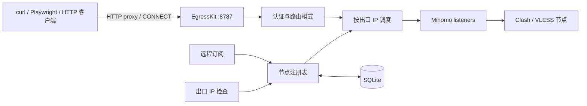
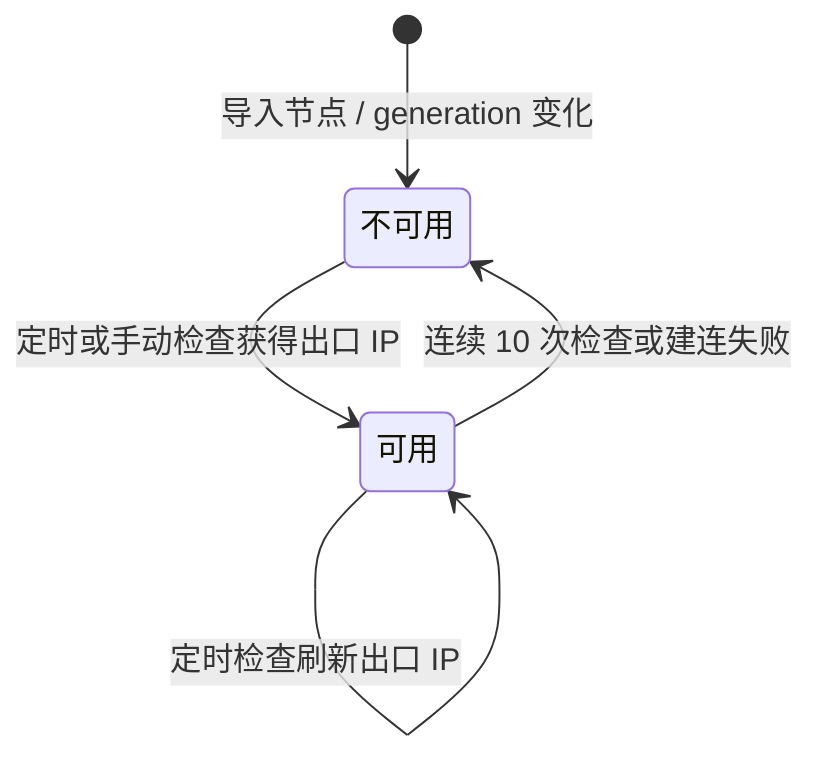

# EgressKit

<p align="center">
  
</p>

<p align="center">将 Clash / VLESS 节点聚合为一个可编程的 HTTP 代理入口。</p>

<p align="center">简体中文 · <a href="README_EN.md">English</a></p>

EgressKit 是一个开源、自托管的代理网关。客户端只连接一个 HTTP 代理地址，通过代理用户名选择轮换出口、会话粘连、严格粘连或指定出口。订阅更新、Mihomo、节点探活、出口 IP 识别、调度和失败回退都由 EgressKit 处理。

> [!IMPORTANT]
> 当前镜像支持 Linux amd64 和 arm64。Windows 不在 v1 支持范围内。

> [!WARNING]
> 状态数据库会以明文保存订阅 URL、节点凭据和 Proxy Token。生产环境必须保护状态目录和备份，并保持代理认证开启。

## 快速开始

### 启动 EgressKit

```bash
docker pull heyjunpenn/egresskit:latest

read -rsp "Admin Token: " EGRESSKIT_ADMIN_TOKEN && echo

docker run --detach \
  --name egresskit \
  --restart unless-stopped \
  --volume egresskit-state:/var/lib/egresskit \
  --publish 127.0.0.1:8787:8787 \
  --env EGRESSKIT_ADMIN_TOKEN \
  heyjunpenn/egresskit:latest
```

打开 <http://127.0.0.1:8787>，输入 Admin Token。


```bash
curl --fail http://127.0.0.1:8787/live
```

### 导入订阅

进入“订阅管理”，点击“添加订阅”，填写名称和 Clash / Mihomo HTTPS 订阅地址，然后点击“导入”。订阅地址包含凭据，只应输入控制台，不要写入仓库或日志。


节点导入后还要识别出口 IP。所有节点都会进入验证队列，出口识别单次最多并发 5 个；节点较多时需要等待几分钟。

```bash
until curl --fail --silent http://127.0.0.1:8787/ready; do
  sleep 5
done
echo
```

`/live` 只表示进程存活；`/ready` 返回 `{"status":"ready"}` 才表示 Mihomo 和至少一个已验证出口可以接流量。


### 用 curl 发起请求

代理使用 HTTP Basic Auth。用户名表示路由模式，密码填写 Proxy Token。Proxy Token 首次与 Admin Token 相同，生产环境应在“设置”页重置为单独的随机值。

```bash
read -rsp "Proxy Token: " EGRESSKIT_PROXY_TOKEN && echo

curl --silent --show-error --max-time 30 \
  --proxy 'http://127.0.0.1:8787' \
  --proxy-user "rotate:${EGRESSKIT_PROXY_TOKEN}" \
  'https://www.cloudflare.com/cdn-cgi/trace'
```

成功响应应包含 `visit_scheme=https`、`tls=`、`http=`、`loc=` 和出口 `ip=`。访问 HTTPS 目标时，curl 会先向 EgressKit 建立 CONNECT 隧道，再由选中的 Mihomo 节点连接目标。

也可以在“快速操作”页面填写目标 URL 并点击“发起请求”，查看请求日志、curl 示例和响应结果。


> 截图来自隔离验证容器，其中使用了测试端口 `18787`；按本文启动时使用 `8787`，操作方式相同。截图中的订阅地址、节点名称、Token 和出口信息均已遮盖。

## 路由模式

| 代理用户名 | 用途 | 出口不可用时 |
| --- | --- | --- |
| `rotate` | 为每个新请求或 CONNECT 隧道选择最长未使用的出口 IP | 建连确认前尝试其他可用出口 |
| `sticky.<session-key>` | 相同 session key 尽量保持同一出口 IP | 可以重新绑定其他出口 IP |
| `strict.<session-key>` | 相同 session key 严格保持同一出口 IP | 同 IP 的传输节点均不可用时失败 |
| `node.<alias-or-id>` | 使用指定节点所代表的出口 IP | 仅在同 IP 的传输节点之间回退 |

`rotate` 的轮换单位是新 HTTP 请求或新 CONNECT 隧道。已经建立的 HTTPS 隧道不会中途切换出口。

```bash
curl \
  --proxy 'http://127.0.0.1:8787' \
  --proxy-user "sticky.crawler-job-42:${EGRESSKIT_PROXY_TOKEN}" \
  'https://example.com'
```

Playwright 示例：

```typescript
import { chromium } from "playwright";

const browser = await chromium.launch({
  proxy: {
    server: "http://127.0.0.1:8787",
    username: "sticky.playwright-session",
    password: process.env.EGRESSKIT_PROXY_TOKEN,
  },
});

const page = await browser.newPage();
await page.goto("https://example.com");
```

浏览器通常会复用连接。需要重新选择出口时，应创建新的浏览器上下文或连接，而不是依赖页面请求次数。

## 工作原理

EgressKit 不直接实现 VLESS。它管理独立的官方 Mihomo 进程，并在其上提供统一的 HTTP 代理入口。



多个节点可能共用一个公网 IP，所以 EgressKit 按经过验证的出口 IP 调度，而不是按节点数量轮换。`rotate` 先选择最长未使用的 IP 组，再从组内选择可用节点；sticky、strict 和指定节点模式也都绑定到出口 IP。

### 代理生命周期



节点只显示“可用”和“不可用”两种状态。有已验证出口 IP 才可用；连续 10 次检查或建连失败后撤销出口 IP 并停止调度。定时任务按节点顺序每轮检查 10 个，单次最多并发 5 个；手动检查支持单个或全量执行。人工停用也不会进入调度池。

对于 HTTPS，EgressKit 在返回 `200 Connection Established` 前可以尝试其他出口。隧道建立后只转发加密字节，不解密内容，也不会自动重放请求；连接中断时由客户端决定是否重连。

## 配置与数据

`EGRESSKIT_ADMIN_TOKEN` 是唯一环境变量。其他配置首次启动时写入 SQLite，并通过控制台更新。

| 配置 | 默认值 |
| --- | ---: |
| 监听地址 | `0.0.0.0:8787` |
| 出口 IP 检查周期 | 30 秒 |
| 每轮出口 IP 检查数 | 10 |
| 出口 IP 探测并发 | 5 |
| 订阅刷新周期 | 600 秒 |
| 建连前尝试次数 | 3 |
| 单次建连超时 | 10 秒 |

Docker 状态目录为 `/var/lib/egresskit`。SQLite 保存订阅、节点、出口身份、会话绑定、设置和处理记录，不保存每个代理请求或数据包。

## 故障排查

```bash
docker ps --filter name=egresskit
curl --include http://127.0.0.1:8787/live
curl --include http://127.0.0.1:8787/ready
docker logs --tail 100 egresskit
```

- `407 Proxy Authentication Required`：Proxy Token 错误，或客户端没有发送代理认证。
- `502 Bad Gateway`：当前候选无法连接目标；检查节点状态、订阅有效性和容器网络。
- `/ready` 返回 503：当前没有已启用且持有已验证出口 IP 的节点。
- Rotate 没有换 IP：客户端可能复用了 CONNECT 隧道，或多个节点共用同一公网 IP。
- IP 查询返回 429：查询站点触发限流，不代表 EgressKit 没有轮换。

## License

EgressKit 使用 Apache-2.0 许可证。Mihomo 作为独立的 GPL-3.0 进程运行；相关许可证、归属和对应源码说明包含在 Docker 镜像中。
