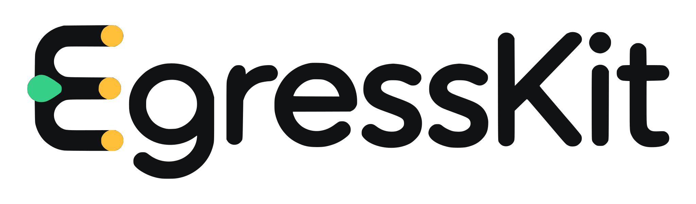
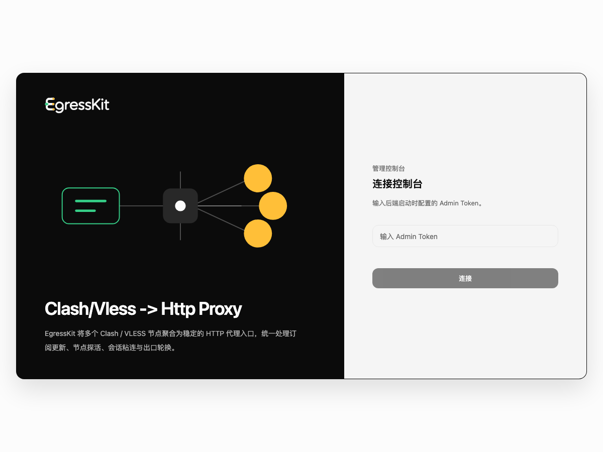
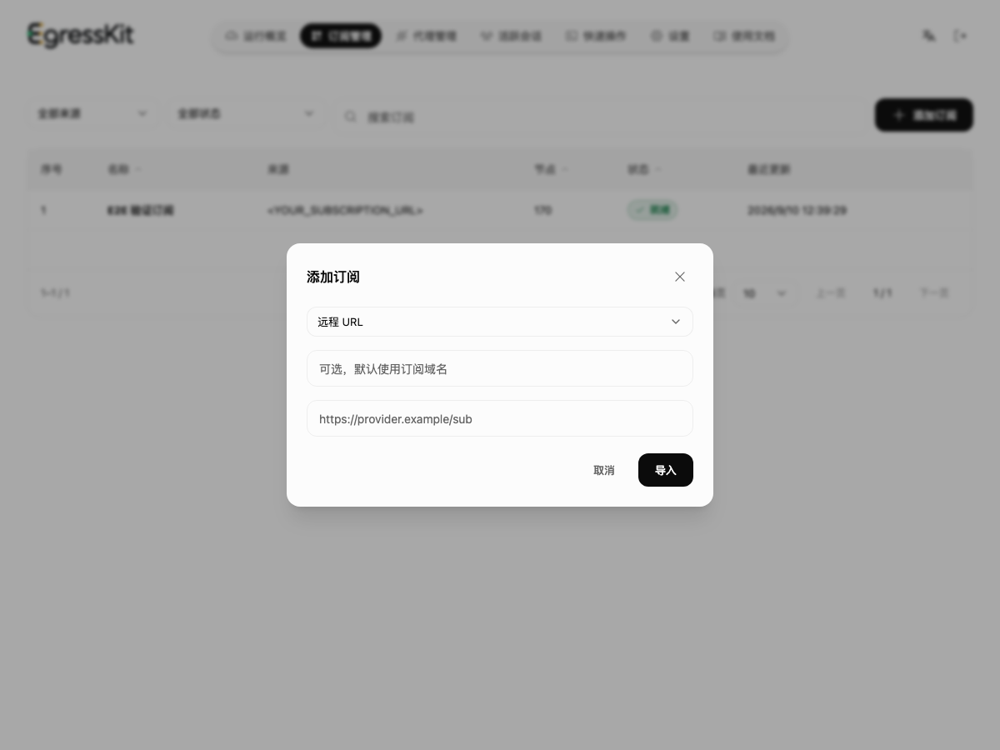
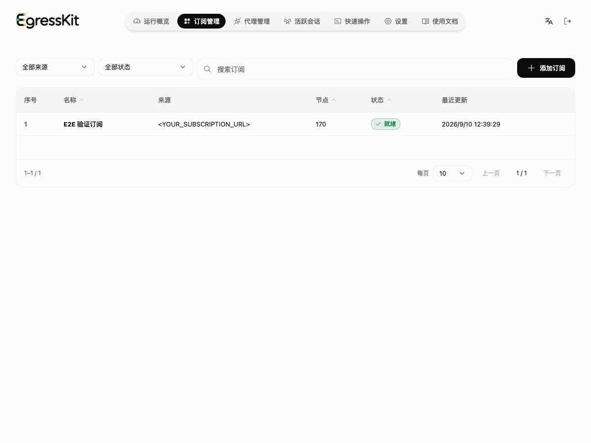
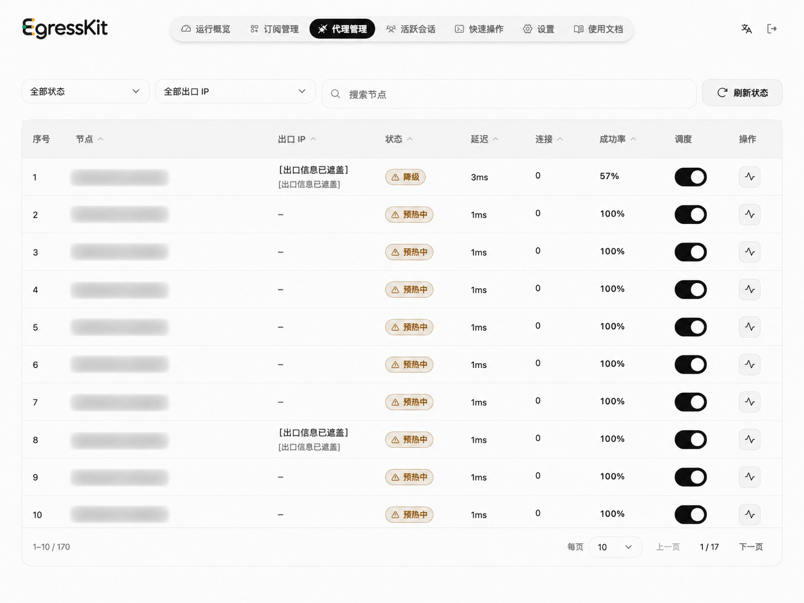
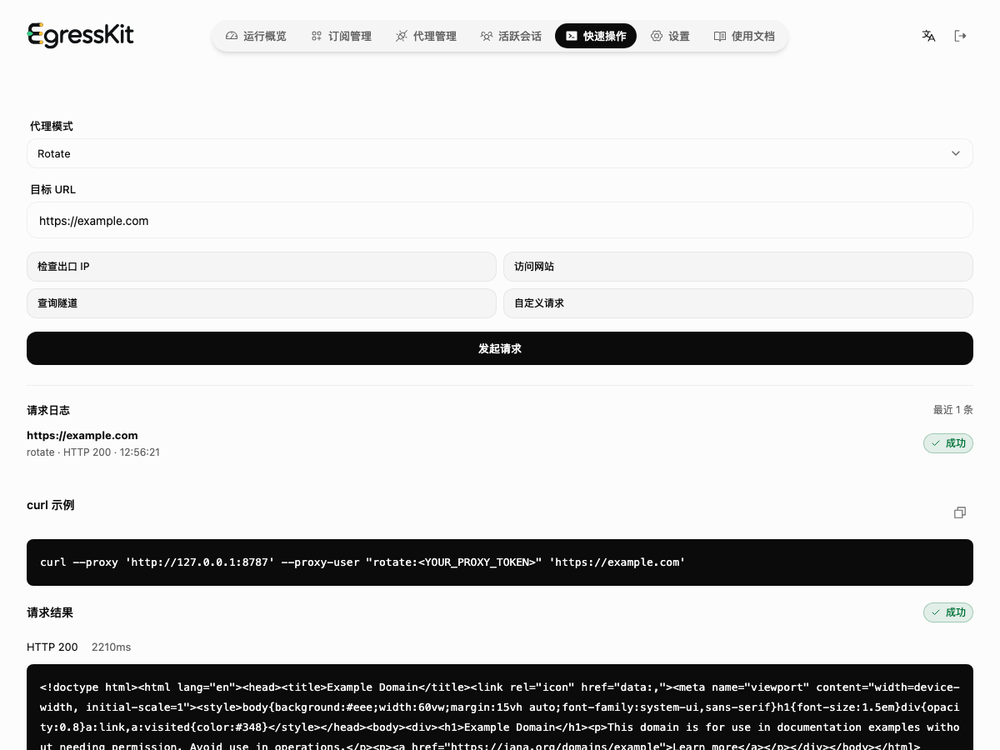
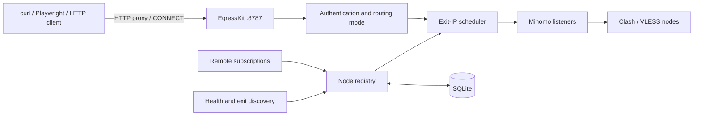

# EgressKit

<p align="center">
  
</p>

<p align="center">Aggregate Clash / VLESS nodes behind one programmable HTTP proxy endpoint.</p>

<p align="center"><a href="README.md">简体中文</a> · English</p>

EgressKit is an open-source, self-hosted proxy gateway. Clients connect to one HTTP proxy and select rotating, sticky, strict-sticky, or explicit egress routing through the proxy username. EgressKit handles subscription updates, Mihomo, health checks, exit-IP discovery, scheduling, and pre-connect fallback.

> [!IMPORTANT]
> The current image supports Linux amd64 and arm64. Windows is outside the v1 support scope.

> [!WARNING]
> Subscription URLs, node credentials, and the Proxy Token are stored in plaintext in the state database. Protect the state directory and its backups, and keep proxy authentication enabled in production.

## Quick start

### Start EgressKit

```bash
docker pull heyjunpenn/egresskit:0.1.0

read -rsp "Admin Token: " EGRESSKIT_ADMIN_TOKEN && echo

docker run --detach \
  --name egresskit \
  --restart unless-stopped \
  --volume egresskit-state:/var/lib/egresskit \
  --publish 127.0.0.1:8787:8787 \
  --env EGRESSKIT_ADMIN_TOKEN \
  heyjunpenn/egresskit:0.1.0
```

Open <http://127.0.0.1:8787> and enter the Admin Token.



```bash
curl --fail http://127.0.0.1:8787/live
```

### Import a subscription

Open Subscriptions, select Add subscription, enter a name and a Clash / Mihomo HTTPS subscription URL, then select Import. A subscription URL contains credentials; enter it only in the console and never commit it or write it to logs.





Imported nodes must still pass health checks and exit-IP discovery. Every node enters the verification queue, with at most five exit probes running concurrently, so large subscriptions may take several minutes.

```bash
until curl --fail --silent http://127.0.0.1:8787/ready; do
  sleep 5
done
echo
```

`/live` only reports process liveness. EgressKit can accept proxy traffic after `/ready` returns `{"status":"ready"}`, meaning Mihomo and at least one verified exit are available.



### Send a request with curl

The proxy uses HTTP Basic Auth. The username selects a routing mode, and the password is the Proxy Token. The Proxy Token initially matches the Admin Token; reset it to a separate random value from Settings before production use.

```bash
read -rsp "Proxy Token: " EGRESSKIT_PROXY_TOKEN && echo

curl --silent --show-error --max-time 30 \
  --proxy 'http://127.0.0.1:8787' \
  --proxy-user "rotate:${EGRESSKIT_PROXY_TOKEN}" \
  'https://www.cloudflare.com/cdn-cgi/trace'
```

A successful response includes `visit_scheme=https`, `tls=`, `http=`, `loc=`, and the exit `ip=`. For an HTTPS target, curl first establishes a CONNECT tunnel through EgressKit, and the selected Mihomo node then connects to the target.

You can also enter a target URL on the Playground page and select Send request to inspect the request log, generated curl command, and response.



> The screenshots were captured from an isolated verification container on host port `18787`; the documented setup uses `8787`. Subscription URLs, node names, tokens, exit IPs, and locations have been redacted.

## Routing modes

| Proxy username | Behavior | When the exit is unavailable |
| --- | --- | --- |
| `rotate` | Selects the least recently used exit IP for each new request or CONNECT tunnel | Tries another available exit before confirming the connection |
| `sticky.<session-key>` | Keeps the same exit IP for a session when possible | May bind the session to another exit IP |
| `strict.<session-key>` | Strictly keeps the same exit IP for a session | Fails when every transport for that IP is unavailable |
| `node.<alias-or-id>` | Uses the exit IP represented by a specific node | Falls back only between transports sharing that IP |

Rotation happens per new HTTP request or new CONNECT tunnel. EgressKit does not switch the exit inside an established HTTPS tunnel.

```bash
curl \
  --proxy 'http://127.0.0.1:8787' \
  --proxy-user "sticky.crawler-job-42:${EGRESSKIT_PROXY_TOKEN}" \
  'https://example.com'
```

Playwright example:

```typescript
import { chromium } from "playwright";

const browser = await chromium.launch({
  proxy: {
    server: "http://127.0.0.1:8787",
    username: "sticky.playwright-session",
    password: process.env.EGRESSKIT_PROXY_TOKEN,
  },
});

const page = await browser.newPage();
await page.goto("https://example.com");
```

Browsers commonly reuse connections. Create a new browser context or connection when you need a new exit selection; page-request count does not equal rotation count.

## How it works

EgressKit does not implement VLESS directly. It manages a separate official Mihomo process and exposes a unified HTTP proxy on top of it.



Several nodes can share one public IP, so EgressKit schedules verified exit IPs rather than counting nodes as distinct exits. `rotate` selects the least recently used IP group and then a healthy transport within that group. Sticky, strict, and explicit-node routes also bind to an exit IP.

For HTTPS, EgressKit can try another exit before returning `200 Connection Established`. After the tunnel is established, EgressKit forwards encrypted bytes without decrypting or replaying requests. The client decides whether to reconnect after a tunnel failure.

## Configuration and data

`EGRESSKIT_ADMIN_TOKEN` is the only environment variable. Other settings are initialized in SQLite and updated through the console.

| Setting | Default |
| --- | ---: |
| Listen address | `0.0.0.0:8787` |
| Health-check interval | 30 seconds |
| Health-check concurrency | 4 |
| Exit-IP probe concurrency | 5 |
| Subscription refresh interval | 600 seconds |
| Pre-connect attempts | 3 |
| Per-attempt connect timeout | 10 seconds |

The Docker state directory is `/var/lib/egresskit`. SQLite stores subscriptions, nodes, exit identities, session bindings, settings, and processing records. It does not store every proxy request or packet.

## Troubleshooting

```bash
docker ps --filter name=egresskit
curl --include http://127.0.0.1:8787/live
curl --include http://127.0.0.1:8787/ready
docker logs --tail 100 egresskit
```

- `407 Proxy Authentication Required`: the Proxy Token is invalid, or the client did not send proxy credentials.
- `502 Bad Gateway`: the current candidates cannot reach the target; inspect node health, subscription validity, and container networking.
- `/ready` returns 503: no node has passed both health checking and exit-IP verification.
- Rotate keeps the same IP: the client may be reusing a CONNECT tunnel, or several nodes may share one public IP.
- An IP lookup returns 429: the lookup provider rate-limited the request; this does not prove that rotation failed.

## License

EgressKit is licensed under Apache-2.0. Mihomo runs as a separate GPL-3.0 process; release artifacts include the relevant licenses, attribution, and corresponding-source information.
